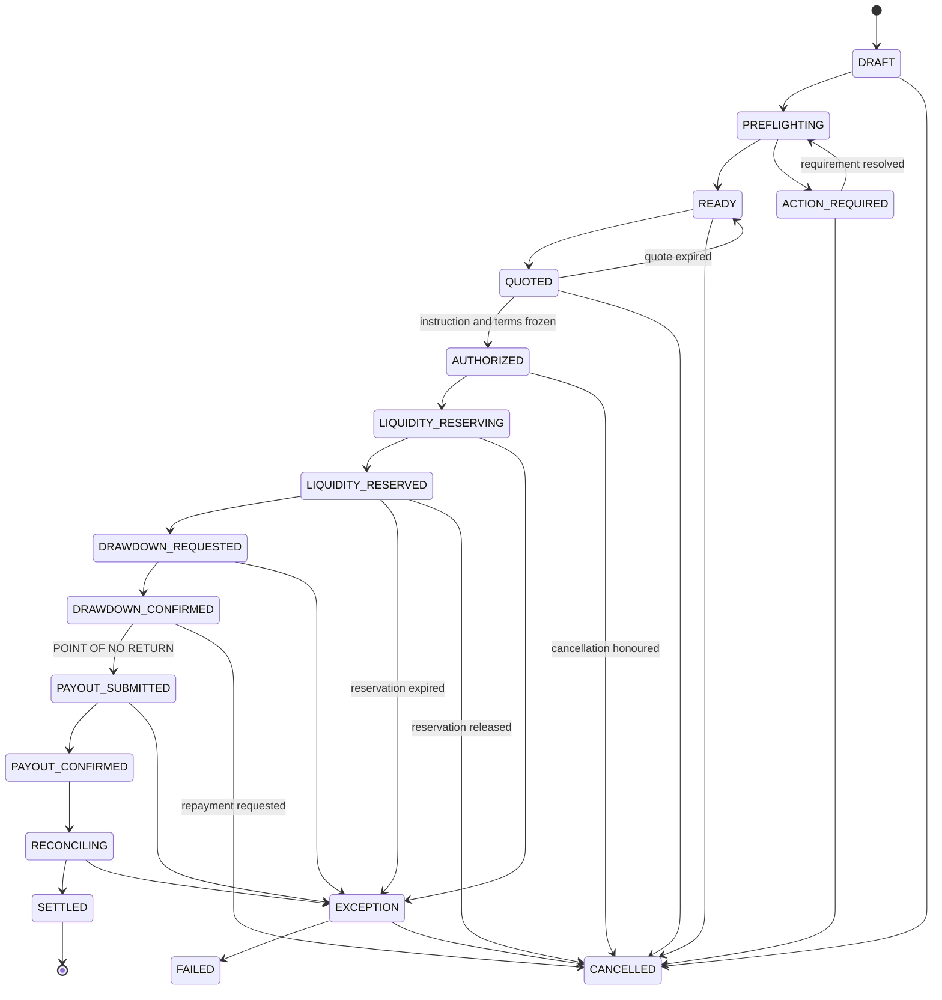

# STATE_MACHINES.md

Status: **Stage 0 — Revision 6 · FROZEN 2026-09-03 · decision cleanup (`D-03` closed; T30/`R04` ownership recorded)**
Depends on: `DOMAIN.md`

Revision 3 changes: one mechanically testable event-pairing rule with a status
event on every status-changing transition; explicit transitions for every sweeper
action; normative transition tables for the six financial sub-machines; the
authorized commitment (destination version + economic terms) frozen at T08;
finality condition F2 narrowed to the facility path; the rail finality hold
window defined as post-settlement policy rather than a gate on `SETTLED`.

---

## 1. Governing principles

1. **One place.** Every financial state transition goes through a single
   transition function per aggregate. There is no second way to change status.
2. **Guarded.** Every transition names its guard. A transition whose guard fails
   is rejected with a typed error, never silently ignored.
3. **Evented.** Every status-changing transition writes exactly one status event
   in the same transaction, plus any companion events it names. The rule and its
   enforcement are in `INV-32`; §4 names both sets for every transition.
4. **Attributed.** Every transition records an actor: user, API key, job, or a
   named provider event.
5. **Total.** Any `(state, trigger)` pair not in these tables is illegal, and
   attempting it raises `invalid_transition` and creates an audit record. **This
   includes sweepers** — a background job that changes state does so through a
   numbered transition like any other caller, never by writing a column.
6. **Idempotent at the edges.** Provider callbacks and job retries re-apply the
   same trigger safely; a transition already applied is a no-op, not an error.
7. **Terminal means terminal.** A terminal state has no outgoing transitions
   (`INV-38`). Later facts about a settled settlement are recorded as *linked
   aggregates*, never as mutations of the settlement (`INV-42`).

## 2. Deltas from the master prompt's enumeration

| Change | Reason |
|---|---|
| **Removed** `QUOTE_CREATED`, `QUOTE_LOCKED` from the settlement machine | These are states of the *quote* aggregate. The settlement gets a single `QUOTED` state; the quote keeps its own lifecycle (§6.1). |
| **Added** `AUTHORIZED` | The prompt has no state for the moment the customer approves the instruction. **`AUTHORIZED` means the instruction and its economics are frozen and execution may begin — not that execution is irreversible.** Irreversibility starts at a separate, explicit boundary (§3.1). |
| **Added** `ACTION_REQUIRED` as an internal state, **scoped to preflight only** | Preflight needs somewhere to park a settlement waiting on the customer, distinct from `DRAFT` and `EXCEPTION`. It is not a general-purpose waiting state — `INV-37`. |
| **Not added:** `RETURNED` as a settlement status | It would make `SETTLED` non-terminal and turn a later independent fact into a mutation of a final record. Post-settlement returns are a linked `SettlementReturn` aggregate (§6.6, §8.4). |

`EXCEPTION` is resumable: the settlement records `exception_entered_from`, so
resolution returns it to the point at which it stalled.

## 3. Settlement — the states

| State | Meaning | Terminal |
|---|---|---|
| `DRAFT` | Being composed. Nothing has been evaluated. | no |
| `PREFLIGHTING` | Requirement evaluation running. | no |
| `ACTION_REQUIRED` | Preflight found blocking requirements. **Preflight only.** | no |
| `READY` | Preflight passed. Nothing blocking. Not yet priced. | no |
| `QUOTED` | An active quote is attached and within its expiry. | no |
| `AUTHORIZED` | Customer approved. Instruction and economics frozen. Execution may begin, and is still cancellable. | no |
| `LIQUIDITY_RESERVING` | Reservation being taken against the facility. | no |
| `LIQUIDITY_RESERVED` | Availability atomically held for this settlement. | no |
| `DRAWDOWN_REQUESTED` | Funds requested from the liquidity provider. | no |
| `DRAWDOWN_CONFIRMED` | Funding leg confirmed real. **Last cancellable state.** | no |
| `PAYOUT_SUBMITTED` | Payout dispatched. **Past the point of no return.** | no |
| `PAYOUT_CONFIRMED` | Provider reports credit, with a UTR. | no |
| `RECONCILING` | Expected outcome being compared to authoritative observation. | no |
| `SETTLED` | Finality conditions all satisfied. Record immutable and **final**. | **yes** |
| `EXCEPTION` | Stalled, needs resolution. Resumable to `exception_entered_from`. | no |
| `FAILED` | Could not complete. No value is with a beneficiary. | **yes** |
| `CANCELLED` | Withdrawn before the point of no return, or terminated without delivery. | **yes** |

Seventeen states. There is no settlement status representing a return.

### 3.1 Authorization, the frozen commitment, and the point of no return

**Authorization** (`INV-35`) is the customer saying *yes, this instruction is
correct*. It freezes two things by value, so that nothing they refer to can move
underneath the settlement afterwards (`DOMAIN.md § 6.5.1`):

- **the destination version** — `destination_version_id` is pinned to the exact
  immutable `PayoutDestinationVersion` that passed `INV-11`. Payout execution
  builds the instruction from that version, never from
  `destination.current_version_id`, and every post-authorization display shows
  that version. A customer editing the destination afterwards creates a new
  version (`INV-44`) and does not touch this settlement.
- **the economic commitment** — `authorized_terms` and `authorized_terms_hash`,
  snapshotted from the consumed quote: `quote_id`, direction, recipient amount,
  funding amount, FX rate, fee components and rounding residual.

What authorization does **not** mean is that the settlement can no longer be
stopped.

**The point of no return (PONR)** is an exact boundary: the **commit of the
dispatch transaction** at T15, specified line by line in `INV-36`. It is not
"when we tried to send the payout" — that phrase has no single instant and
cannot be tested.

The dispatch transaction takes a row lock on the settlement, re-checks for a
pending cancellation under that lock, stamps `point_of_no_return_at`, writes the
`PayoutAttempt` with its durable provider idempotency key, writes the status
event, and enqueues the outbound call. The boundary is that commit.

Cancellation contends for the same row lock, so the two are strictly ordered:
either cancellation commits first and dispatch aborts to `CANCELLED`, or dispatch
commits first and cancellation is refused with `past_point_of_no_return`. Nothing
interleaves.

The provider call happens *after* commit, from the enqueued job. If it times out,
fails, or the worker dies, the settlement is still past the PONR — a durable
attempt with a stable idempotency key exists, so a real payout may exist in India
regardless of what the local call reported. That resolves through the
authoritative status pull, never by cancelling.

Between `AUTHORIZED` and the PONR there is a **cancellation window**. The
customer may request cancellation at any point in it; the request is honoured at
the next checkpoint, with compensation:

| Cancelled from | Compensation |
|---|---|
| `AUTHORIZED` | Void the consumed quote. Nothing else has moved. |
| `LIQUIDITY_RESERVING` | Abort before the reservation is taken. |
| `LIQUIDITY_RESERVED` | Release the `ACTIVE` reservation (`INV-22`). |
| `DRAWDOWN_REQUESTED` | Not honoured here — a provider call is in flight. Held and honoured on arrival at `DRAWDOWN_CONFIRMED`. |
| `DRAWDOWN_CONFIRMED` | The reservation is `CONSUMED` and is **not** released. A `Repayment` is *requested*; facility capacity returns only when that repayment is `CONFIRMED` (`INV-46`). |

Cancellation is a **request**, never a direct transition, once the settlement is
authorized. It sets `cancellation_requested_at`; the machine decides when it
takes effect.



`SETTLED` has no outgoing edge. That is the point.

## 4. Settlement — the transition table

Normative and total. Every row names its **status event** (exactly one, enforced
by the trigger in `INV-32`) and its **companion events** (any number, enforced by
a table-driven test). `guard` must hold or the transition is rejected.

| # | From | Trigger | To | Guard | Status event | Companion events |
|---|---|---|---|---|---|---|
| T01 | — | `create` | `DRAFT` | workspace active; environment valid | `settlement.created` | — |
| T02 | `DRAFT` | `run_preflight` | `PREFLIGHTING` | beneficiary + amount + purpose present | `settlement.preflight_started` | — |
| T03 | `PREFLIGHTING` | `preflight_passed` | `READY` | zero blocking requirements | `settlement.ready` | `settlement.preflight_completed` |
| T04 | `PREFLIGHTING` | `preflight_blocked` | `ACTION_REQUIRED` | ≥1 blocking requirement. **The only transition into `ACTION_REQUIRED`** (`INV-37`) | `settlement.action_required` | `settlement.preflight_completed` |
| T05 | `ACTION_REQUIRED` | `requirement_resolved` | `PREFLIGHTING` | at least one requirement changed | `settlement.preflight_started` | — |
| T06 | `READY` | `attach_quote` | `QUOTED` | quote `ACTIVE`, unexpired, unconsumed, same workspace + environment, matching amount and currencies | `settlement.quoted` | `quote.locked` |
| T07 | `QUOTED` | `quote_expired` | `READY` | `now > quote.expires_at` | `settlement.ready` | `quote.expired` |
| T08 | `QUOTED` | `authorize` | `AUTHORIZED` | quote valid; beneficiary `VERIFIED`; **destination version `VERIFIED`** (`INV-11`); actor holds `settlement:authorize`; preflight still passing; **an active liquidity facility exists** (F2, `D-10`) | `settlement.authorized` | `quote.consumed` |
| T09 | `AUTHORIZED` | `begin_reservation` | `LIQUIDITY_RESERVING` | facility active; no cancellation pending | `settlement.liquidity_reservation_started` | — |
| T10 | `LIQUIDITY_RESERVING` | `reservation_succeeded` | `LIQUIDITY_RESERVED` | `available >= amount` inside the facility row lock (`INV-20`) | `settlement.liquidity_reserved` | `facility.reservation_created` |
| T11 | `LIQUIDITY_RESERVING` | `reservation_failed` | `EXCEPTION` | insufficient availability or facility suspended | `settlement.exception_opened` | — |
| T12 | `LIQUIDITY_RESERVED` | `request_drawdown` | `DRAWDOWN_REQUESTED` | under the settlement row lock: `ACTIVE` reservation exists; `cancellation_requested_at IS NULL` (checkpoint) | `settlement.drawdown_requested` | — |
| T13 | `DRAWDOWN_REQUESTED` | `drawdown_confirmed` | `DRAWDOWN_CONFIRMED` | provider event verified and idempotent | `settlement.drawdown_confirmed` | `facility.drawdown_confirmed` |
| T14 | `DRAWDOWN_REQUESTED` | `drawdown_failed` | `EXCEPTION` | verified failure event | `settlement.exception_opened` | `facility.reservation_released` |
| T15 | `DRAWDOWN_CONFIRMED` | `dispatch_payout` | `PAYOUT_SUBMITTED` | under the settlement row lock: rail selected; **frozen destination version still `VERIFIED`**; `cancellation_requested_at IS NULL`; `point_of_no_return_at IS NULL` | `settlement.payout_submitted` | — |
| T16 | `PAYOUT_SUBMITTED` | `payout_credited` | `PAYOUT_CONFIRMED` | trusted provider event; UTR present and well-formed | `settlement.payout_confirmed` | — |
| T17 | `PAYOUT_SUBMITTED` | `payout_rejected` | `EXCEPTION` | trusted provider rejection | `settlement.exception_opened` | — |
| T18 | `PAYOUT_SUBMITTED` | `payout_timeout` | `EXCEPTION` | no terminal status within the rail SLA. **Never auto-retry** (`INV-24`) | `settlement.exception_opened` | — |
| T19 | `PAYOUT_CONFIRMED` | `begin_reconciliation` | `RECONCILING` | — | `settlement.reconciliation_started` | — |
| T20 | `RECONCILING` | `reconciled_matched` | `SETTLED` | **all** finality conditions F1–F6 (§8.1) | `settlement.settled` | `settlement.reconciled`, `receipt.available` |
| T21 | `RECONCILING` | `reconciled_mismatch` | `EXCEPTION` | non-zero delta (`INV-26`) | `settlement.exception_opened` | `settlement.reconciled` |
| T22 | `EXCEPTION` | `resolve_resume` | `exception_entered_from` | attributed resolution recorded | `settlement.exception_resolved` | — |
| T23 | `EXCEPTION` | `resolve_fail` | `FAILED` | attributed decision; no value delivered | `settlement.failed` | `facility.reservation_released` *or* `facility.repayment_requested` |
| T24 | `EXCEPTION` | `resolve_cancel` | `CANCELLED` | attributed decision; **pre-PONR only** | `settlement.cancelled` | `facility.reservation_released` *or* `facility.repayment_requested` |
| T25 | `DRAFT`, `READY`, `QUOTED`, `ACTION_REQUIRED` | `cancel` | `CANCELLED` | actor holds `settlement:cancel` | `settlement.cancelled` | `quote.expired` if a quote was attached |
| T26 | `AUTHORIZED`, `LIQUIDITY_RESERVING`, `LIQUIDITY_RESERVED`, `DRAWDOWN_REQUESTED`, `DRAWDOWN_CONFIRMED` | `request_cancellation` | *(no state change)* | under the settlement row lock: `point_of_no_return_at IS NULL`; actor holds `settlement:cancel` | **none** — no status change, so no status event | `settlement.cancellation_requested` |
| T27 | `AUTHORIZED`, `LIQUIDITY_RESERVED`, `DRAWDOWN_CONFIRMED` | `cancellation_honoured` | `CANCELLED` | cancellation pending; at a checkpoint; still pre-PONR | `settlement.cancelled` | from `LIQUIDITY_RESERVED`: `facility.reservation_released`. From `DRAWDOWN_CONFIRMED`: `facility.repayment_requested` (**not** a reservation release — `INV-22`) |
| T28 | `LIQUIDITY_RESERVED` | `reservation_expired` | `EXCEPTION` | reservation TTL reached without drawdown (**reservation sweeper**) | `settlement.exception_opened` | `facility.reservation_expired` |
| T29 | `DRAWDOWN_REQUESTED` | `drawdown_timeout` | `EXCEPTION` | no terminal drawdown status within SLA (**drawdown watcher**). Never resubmit blindly | `settlement.exception_opened` | — |
| T30 | `RECONCILING` | `reconciliation_stalled` | `EXCEPTION` | no authoritative observation within SLA (**reconciliation poller**); opens `FINALITY_EVIDENCE_MISSING` | `settlement.exception_opened` | `R04` on the reconciliation |

**T26 is an annotation, not a transition** — it records intent without moving the
machine, which is why it is the one row with no status event. A cancellation
request arriving while a provider call is in flight must not race the call; T27
is where it takes effect.

**T30's `R04` companion is owed by Stage 6.** The settlement side of T30 is
complete as of Stage 3: the transition, its guard, its status event and the
`FINALITY_EVIDENCE_MISSING` exception all exist and are enforced. `R04`
annotates the *reconciliation* record, and no reconciliation aggregate exists
until Stage 6 — so the companion is declared as a typed deferred obligation on
the transition rather than emitted against a record invented to satisfy it. An
event about a record that does not exist is not evidence of anything, and would
have to be unpicked later. Stage 6 closes this by emitting `R04` from T30
against the real reconciliation; until then the obligation is enumerable in code
rather than remembered.

`SETTLED` appears in the `To` column and never in the `From` column.

## 5. Customer projection

Normative mapping from internal `status` to the five customer-facing states.
`customer_status` is derived, never independently set (`INV-18`).

| Internal | Customer-facing | Note |
|---|---|---|
| `DRAFT` | *not listed* | Drafts appear only in the composing surface |
| `PREFLIGHTING` | `READY` | Show a brief checking state, not a new status |
| `ACTION_REQUIRED` | `ACTION_REQUIRED` | With the precise requirement copy |
| `READY`, `QUOTED` | `READY` | |
| `AUTHORIZED` → `RECONCILING` | `SETTLING` | The whole execution span is one customer state |
| `SETTLED` | `SETTLED` | Even where a return exists — the return is shown separately (§8.5) |
| `EXCEPTION`, customer-actionable | `ACTION_REQUIRED` | See §7 for which codes qualify |
| `EXCEPTION`, not customer-actionable | `SETTLING` + delay note | Ops owns it; do not alarm the customer with something they cannot fix |
| `FAILED` | `CANCELLED` | With resolution reason. `D-03` **closed**: no sixth V1 customer state |
| `CANCELLED` | `CANCELLED` | With resolution reason |

Customer-facing `ACTION_REQUIRED` has exactly two sources: the internal
`ACTION_REQUIRED` state (preflight), and an open customer-actionable exception.
The internal state itself remains preflight-only (`INV-37`); the projection is
where the two meet.

## 6. The financial sub-machines

Six aggregates carry financial state. Each has a normative, total transition
table. Beneficiary verification (§6.7) and batches (§6.8) are not financial and
keep arrow notation.

### 6.1 Quote — its own aggregate

| # | From | Trigger | To | Guard |
|---|---|---|---|---|
| Q01 | — | `create` | `ACTIVE` | priced against a live rate |
| Q02 | `ACTIVE` | `lock` | `LOCKED` | attached by T06 |
| Q03 | `LOCKED` | `consume` | `CONSUMED` | consumed by T08; at most one settlement (`INV-14`) |
| Q04 | `ACTIVE`, `LOCKED` | `expire` | `EXPIRED` | `now > expires_at`, server clock (`INV-15`) — **quote sweeper** |
| Q05 | `ACTIVE`, `LOCKED` | `void` | `VOID` | settlement cancelled, or a re-quote requested |

A quote is immutable once created (`INV-13`). A locked quote that expires before
authorization does not silently re-price: the settlement returns to `READY`
(T07) and the customer sees a fresh quote.

### 6.2 Liquidity reservation

| # | From | Trigger | To | Guard | Effect on the facility |
|---|---|---|---|---|---|
| V01 | — | `reserve` | `ACTIVE` | facility row lock, `available >= amount` (`INV-20`) | `reserved` rises |
| V02 | `ACTIVE` | `consume` | `CONSUMED` | drawdown confirmed (T13) | `reserved` falls, `drawn` rises |
| V03 | `ACTIVE` | `release` | `RELEASED` | cancel before drawdown, or failure before drawdown; idempotent | `reserved` falls |
| V04 | `ACTIVE` | `expire` | `EXPIRED` | TTL reached without drawdown — **reservation sweeper**, drives T28 | `reserved` falls |

**A `CONSUMED` reservation has no outgoing transition.** There is no release path
from it, and attempting one is a typed error (`INV-22`). Capacity after a
confirmed drawdown returns only through a confirmed repayment (§6.5).

### 6.3 Payout attempt

| # | From | Trigger | To | Guard |
|---|---|---|---|---|
| P01 | — | `dispatch` | `SUBMITTED` | created inside the dispatch transaction (`INV-36`) |
| P02 | `SUBMITTED` | `accepted` | `ACCEPTED` | trusted provider acknowledgement |
| P03 | `SUBMITTED`, `ACCEPTED` | `credited` | `CREDITED` | trusted event with a well-formed UTR |
| P04 | `SUBMITTED`, `ACCEPTED` | `rejected` | `REJECTED` | trusted rejection |
| P05 | `SUBMITTED`, `ACCEPTED` | `sla_elapsed` | `UNKNOWN` | no terminal status within the rail SLA — **payout status poller** |
| P06 | `UNKNOWN` | `pull_resolved_credited` | `CREDITED` | **authoritative status pull only**, never a resubmit (`INV-24`) |
| P07 | `UNKNOWN` | `pull_resolved_rejected` | `REJECTED` | authoritative status pull only |
| P08 | `CREDITED` | `returned` | `RETURNED` | a confirmed `SettlementReturn` covering the full delivered amount |

`RETURNED` exists here, on the rails-level execution, and does not propagate to
the settlement's status. It opens a `SettlementReturn` (§6.6).

### 6.4 Reconciliation

| # | From | Trigger | To | Guard |
|---|---|---|---|---|
| R01 | — | `begin` | `PENDING` | opened by T19 |
| R02 | `PENDING` | `observed_matching` | `MATCHED` | authoritative observation; delta exactly zero (`INV-26`) |
| R03 | `PENDING` | `observed_differing` | `MISMATCH` | authoritative observation; non-zero delta |
| R04 | `PENDING` | `observation_overdue` | `MANUAL_REVIEW` | no authoritative observation within SLA — **reconciliation poller**, drives T30. Built in Stage 6; T30's settlement side is complete from Stage 3 and carries R04 as a declared deferred companion |
| R05 | `MISMATCH` | `escalate` | `MANUAL_REVIEW` | automatic; a mismatch is never left unattended |
| R06 | `MANUAL_REVIEW` | `resolve_matched` | `MATCHED` | attributed operator decision **plus** a compensating entry where value moved incorrectly (`INV-27`) |
| R07 | `MANUAL_REVIEW` | `resolve_unresolvable` | `MISMATCH` | attributed decision; the settlement then fails via T23 |

Zero tolerance by default. `MATCHED` is the only reconciliation state that can
satisfy finality condition F5.

### 6.5 Repayment

Capacity comes back on exactly one transition, and it is not the one that creates
the repayment.

| # | From | Trigger | To | Guard | Effect on the facility |
|---|---|---|---|---|---|
| Y01 | — | `request` | `REQUESTED` | cancellation after confirmed drawdown (T27/T23/T24), or a confirmed return (N02) | **none** |
| Y02 | `REQUESTED` | `submit` | `SUBMITTED` | provider call enqueued with a stable `request_fingerprint` | **none** |
| Y03 | `SUBMITTED` | `confirmed` | `CONFIRMED` | trusted provider confirmation | **`drawn` falls; availability rises. The only such transition** (`INV-46`) |
| Y04 | `SUBMITTED` | `rejected` | `FAILED` | trusted rejection | none |
| Y05 | `SUBMITTED` | `sla_elapsed` | `UNKNOWN` | no terminal status within SLA — **repayment watcher** | none |
| Y06 | `UNKNOWN` | `pull_resolved_confirmed` | `CONFIRMED` | **authoritative status pull only** (`INV-47`) | `drawn` falls |
| Y07 | `UNKNOWN` | `pull_resolved_failed` | `FAILED` | authoritative status pull only | none |
| Y08 | `FAILED` | `re_request` | `REQUESTED` | attributed operator decision; a **new** `request_fingerprint` | none |

A `REQUESTED`, `SUBMITTED` or `UNKNOWN` repayment is `repayment_in_flight`:
visible to operations, excluded from `available` (`INV-19`, `INV-46`).

### 6.6 Settlement return

| # | From | Trigger | To | Guard |
|---|---|---|---|---|
| N01 | — | `open` | `OBSERVED` | trusted provider event or authoritative pull (`INV-39`); deduplicated on `(payout_attempt_id, provider_return_reference)` (`INV-50`) |
| N02 | `OBSERVED` | `upheld` | `CONFIRMED` | authoritative check upholds it (`INV-40`) **and** the cumulative cap holds under the payout-attempt row lock (`INV-49`). Requests a `Repayment` (Y01) |
| N03 | `OBSERVED` | `not_upheld` | `REJECTED` | authoritative check does not substantiate it; alarms |
| N04 | `OBSERVED`, `CONFIRMED` | `escalate` | `MANUAL_REVIEW` | unmapped reason code (`INV-43`), arrival outside the return observation window (§8.6), a cap breach (`INV-49`), or check SLA elapsed — **return watcher** |
| N05 | `CONFIRMED` | `repaid` | `REPAID` | its `Repayment` reached `CONFIRMED` (Y03/Y06) |
| N06 | `MANUAL_REVIEW` | `resolve_upheld` | `CONFIRMED` | attributed decision; cap re-checked |
| N07 | `MANUAL_REVIEW` | `resolve_not_upheld` | `REJECTED` | attributed decision |

### 6.7 Beneficiary and destination version

```
Beneficiary          DRAFT → PENDING_VERIFICATION → VERIFIED | REJECTED
                     VERIFIED → DISABLED

DestinationVersion   UNVERIFIED → VERIFYING → VERIFIED | FAILED
```

Editing a destination **appends a new version** starting `UNVERIFIED` (`INV-44`).
It does not reset the previous version, which keeps its verification and remains
the version any already-authorized settlement will pay (`INV-45`).

### 6.8 Batch

```
DRAFT → VALIDATING → READY → EXECUTING → COMPLETED | PARTIALLY_COMPLETED
```

A batch is a container, not a transaction, and never blocks on a single row
(`INV-30`).

## 7. Exception taxonomy

`EXCEPTION` is a state, not a dumping ground. The set of exception codes is
**closed**: adding one is a code change that must supply a phase, an
actionability classification, and the customer copy for both classifications.
There is no free-text exception and no `OTHER`.

**Closed taxonomy, open mapping.** The taxonomy being closed must never mean a
provider can break event processing by sending something new. Those are separate
layers: the taxonomy is a code change, the provider-to-taxonomy mapping is a
versioned data table, and an unmapped provider code routes to a
phase-appropriate default that is always non-customer-actionable, carries the raw
code as data, and raises an `unmapped_provider_code` alarm. Ingestion never
consults the taxonomy at all — a provider event is verified and persisted raw
before interpretation begins (`INV-33`), and interpretation cannot throw
(`INV-43`).

| Code | Phase | Customer-actionable | Resolution path |
|---|---|---|---|
| `LIQUIDITY_UNAVAILABLE` | reservation | no | Ops: raise limit, wait for headroom, or fail |
| `FACILITY_SUSPENDED` | reservation | no | Ops: facility-level decision |
| `DRAWDOWN_FAILED` | funding | no | Ops: retry via provider or fail |
| `DRAWDOWN_STATUS_UNKNOWN` | funding | no | Ops: authoritative status pull |
| `PAYOUT_REJECTED_DESTINATION` | payout | **yes** | Correct the beneficiary, then create a replacement settlement (§7.1) |
| `PAYOUT_REJECTED_COMPLIANCE` | payout | **yes** | Supply the named documentation, or ops decision |
| `PAYOUT_REJECTED_PROVIDER` | payout | no | Ops: replacement settlement or fail |
| `PAYOUT_STATUS_UNKNOWN` | payout | no | Ops: authoritative status pull (`INV-24`) |
| `RECONCILIATION_MISMATCH` | reconciliation | no | Ops decision; policy is `D-14` |
| `FINALITY_EVIDENCE_MISSING` | finality | no | Ops: obtain the missing condition, or escalate |

Every exception carries: code, opened-at, `exception_entered_from`, severity SLA,
the four-field customer copy from `PRODUCT.md § 7.1` when customer-actionable,
and — on resolution — an attributed actor and a mandatory reason. Exceptions
raised from an unmapped provider input additionally carry `provider_raw_code`,
`provider_raw_message`, `provider_event_id` and `classification: unmapped`.

### 7.1 Replacement settlements

The instruction is frozen at `AUTHORIZED` (`INV-16`), so a payout rejected for
bad destination details cannot be "fixed and retried" in place — and because the
settlement is bound to a **destination version**, correcting the beneficiary
cannot retroactively change what that settlement would pay either. The customer
corrects the destination, which appends a new version (`INV-44`), and creates a
**replacement settlement** bound to that new version. The original resolves to
`FAILED`.

**The link is one-directional and forward-only.** The replacement carries
`replaces_settlement_id`, set at creation and never updated. The original — which
is terminal — is not touched, because a terminal settlement accepts no field
writes (`INV-38`). The reverse relationship is derived two ways: an index on
`replaces_settlement_id`, and the append-only `settlement.replacement_created`
event.

A convenience pointer written back onto a `FAILED` settlement would be the first
crack in terminality: once one column may be updated on a terminal row "because
it is only metadata", the trigger that protects settled financial records has to
be weakened to allow it.

## 8. Finality, immutability, and post-settlement returns

### 8.1 What creates finality

`SETTLED` is created by exactly one component — the **finality evaluator** — and
only when **all** of these hold:

- **F1** An `AUTHORIZED` transition exists, attributed to a principal that held
  `settlement:authorize` at the time.
- **F2** The funding leg is real: a **confirmed drawdown against an active
  liquidity facility**. V1 has no second funding path (`D-10`, closed).
- **F3** A terminal credit confirmation has been received from the payout
  provider over a **trusted channel** — a webhook whose signature verified
  against the provider's current key, or a response to an authenticated request
  INRSettle itself initiated.
- **F4** A **UTR** is present and well-formed for the credited payout.
- **F5** Reconciliation is `MATCHED` with a delta of exactly zero.
- **F6** No blocking exception is open on the settlement.

**F1–F6 are evidentiary, not temporal.** No finality condition waits out a timer,
a window or a settlement date. `SETTLED` means *we hold the evidence that the
money arrived as instructed*, and that evidence is either complete or it is not.

There is no duration anywhere in this system's definition of finality. `SETTLED`
is unambiguous and unqualified: it never means "final so far", "probably final",
or "final unless something arrives later".

The evaluator is pure: same inputs, same verdict, and it explains itself. Every
evaluation persists which conditions passed and which did not, so any question
about why a settlement is or is not final has a recorded answer. It additionally
asserts that the executed payout matches `authorized_terms_hash` and the frozen
`destination_version_id` — a drift between what was authorized and what was
executed blocks finality rather than being reconciled away.

### 8.2 What must never create finality

- a screenshot or any uploaded image
- a manual "mark as paid" button — no such control exists in any surface
- a customer claim or customer-supplied status
- client-side state of any kind
- an unverified webhook, a webhook with a timestamp outside tolerance in either
  direction, or a replayed webhook
- an operator's belief, however senior the operator

There is no override, no force-settle, no admin backdoor. If finality cannot be
evaluated, the settlement stays in `RECONCILING` or `EXCEPTION` until the missing
evidence exists.

### 8.3 Immutability

Once `SETTLED`, the settlement's financial record is immutable and the settlement
has **no outgoing transitions**. Its receipt is a write-once artifact whose bytes
and `content_hash` never change (`INV-48`). Later facts are recorded as linked
aggregates and separate artifacts that reference it.

### 8.4 The `SettlementReturn` aggregate

Indian credits can be returned after the provider reported success. That is a
real, later, independent fact about a rails-level execution, modelled as its own
aggregate (`DOMAIN.md § 6.10`) with the lifecycle in §6.6.

1. Opened only by a trusted provider event or an authoritative status pull
   (`INV-39`), and deduplicated so one real-world return is one row (`INV-50`).
2. `OBSERVED → CONFIRMED` requires an authoritative check (`INV-40`) **and** the
   cumulative cap: confirmed returns can never exceed what was delivered
   (`INV-49`). A breach goes to `MANUAL_REVIEW` and alarms.
3. Confirmation **requests** a `Repayment` (Y01). It posts no ledger entry and
   changes no availability. The facility recovers capacity only when that
   repayment is `CONFIRMED` (Y03), at which point the return becomes `REPAID`
   (`INV-41`, `INV-46`).
4. A return never releases a reservation — the reservation was consumed at
   drawdown, and `CONSUMED` has no release path (`INV-22`).
5. An unmapped return reason still opens a return; it starts in `MANUAL_REVIEW`
   and alarms (`INV-43`). An unrecognised reason is never a reason to drop one.
6. Partial returns are supported, and multiple returns against one settlement are
   separate rows, subject in aggregate to `INV-49`.
7. The settlement row, its receipt bytes and its receipt `content_hash` are
   **byte-identical** before and after (`INV-42`, `INV-48`).

### 8.5 How a return is surfaced

The settlement stays `SETTLED`, because it was. The return is a linked object
with its own status, made impossible to miss:

- Settlement detail carries a persistent return notice above the fold with the
  return's own state — *Return reported* / *Return confirmed* / *Funds released*
  / *Return not upheld* — amount, reason and date.
- The receipt is not rewritten. A separate immutable **Return Notice** artifact
  is created, with its own serialisation, `content_hash` and write-once PDF, and
  linked to both the return and the receipt. UI and API compose the two for
  reading; an optional composite export is a **third** artifact with its own
  hash that replaces neither.
- Settlement lists expose `has_open_return` / `has_confirmed_return` filters and
  show a return marker on the row.
- Webhooks fire `settlement.return_observed`, `settlement.return_confirmed`,
  `settlement.return_repaid`, `settlement.return_rejected`.

**Known tension, accepted deliberately:** a customer scanning a list sees
`SETTLED` on a settlement whose money came back. Mutating a final record, or
projecting the return onto `CANCELLED`, is worse — it destroys the distinction
between *never delivered* and *delivered then returned*, and those have different
consequences for the customer's own books.

### 8.6 The rail return observation window

Configuration name: `return_observation_window`, one duration per rail.

**This window has nothing to do with finality.** It is a triage parameter on the
return machine and nothing else: it decides whether a return that arrives is
treated as ordinary or as an anomaly.

| Return arrives | Handling |
|---|---|
| **Within** the rail's return observation window | Normal path: `OBSERVED → CONFIRMED` on an authoritative check (N02) |
| **Outside** it | Anomaly path: opens straight into `MANUAL_REVIEW` (N04). A return this late means the provider's own reporting is in question and a human must look. |

#### Why it is not called a finality hold window

Earlier drafts used that name, and the name was doing damage. "Finality hold
window" implies `SETTLED` is provisional until the window elapses — that there is
some later moment when a settlement becomes *more* final. There is not.

A settlement becomes `SETTLED` the instant F1–F6 hold, however recently the
credit landed, and it is fully and permanently final at that instant. A later
return does not retract it, downgrade it, or qualify it; it is a new,
independently recorded fact (§8.4). The window never delays `SETTLED`, never
appears in a finality condition, and is never surfaced to a customer as a
countdown, a caveat or a risk indicator.

Delaying every settlement to hedge against a rare return would trade a
correctly-modelled exception for a universal delay, and would make `SETTLED` mean
"probably safe by now" instead of "the evidence is complete". That trade is
refused.

`D-04` remains open for the window's **duration per rail**, to be confirmed with
the payout partner. Its role is settled here and is not part of that open
question. Whether a return-risk timestamp is ever exposed to customers is not a
V1 question and is not carried as an open decision — it would need evidence from
a real payout partner or customer that it is operationally needed.

## 9. Timeouts and sweepers

Every waiting state has an owner, a deadline, and a **numbered transition**.
Sweepers change state through the machine like any other caller; none writes a
column directly.

| Watcher | Watches | Action | Transition |
|---|---|---|---|
| Quote sweeper | `ACTIVE`/`LOCKED` quotes past `expires_at` | expire the quote; settlements return to `READY` | `Q04` + `T07` |
| Reservation sweeper | `ACTIVE` reservations past TTL | release availability; open an exception | `V04` + `T28` |
| Cancellation checkpoint | settlements with `cancellation_requested_at` set, pre-PONR | honour with compensation | `T27` |
| Drawdown watcher | `DRAWDOWN_REQUESTED` past SLA | open exception; never resubmit | `T29` |
| Payout status poller | `PAYOUT_SUBMITTED` past the rail SLA | mark the attempt `UNKNOWN`; open exception | `P05` + `T18` |
| Reconciliation poller | `RECONCILING` without an observation | escalate reconciliation; open exception | `R04` + `T30` |
| Repayment watcher | `SUBMITTED` repayments past SLA | mark `UNKNOWN`; resolve by pull only | `Y05` |
| Return watcher | `OBSERVED` returns past their check SLA | escalate to manual review | `N04` |
| Stale exception alarm | `EXCEPTION` open beyond its severity SLA | page operations | *no state change* |

Sweepers are idempotent, run on the Postgres-backed job runner, and take advisory
locks so two workers never process one row.

## 10. Testing obligations

Stage 3 does not exit until 1–8 pass; Stage 4 adds 9–10; Stage 6 adds 11–15.

1. **Exhaustive illegal-transition test** — every `(state, trigger)` pair not in
   §4 is rejected with `invalid_transition`.
2. **Terminality test** — `SETTLED`, `FAILED` and `CANCELLED` accept no trigger in
   the vocabulary, and no field write (`INV-38`).
3. **`ACTION_REQUIRED` narrowness test** — T04 is its only entry (`INV-37`).
4. **Event-pairing test** — the constraint trigger rejects any transaction that
   updates `settlements.status` without writing exactly one status event, and
   rejects one that writes two. A table-driven test then asserts each transition
   emits exactly the status event **and** companion set named in §4, and that
   T26 writes no status event (`INV-32`).
5. **Totality test** — every sweeper action in §9 resolves to a transition id
   present in a table in §4 or §6. A sweeper that changes state without one fails
   the build.
6. **Commitment-freeze test** — after `AUTHORIZED`: editing the destination
   creates a new version and the settlement still pays the frozen one; the API,
   UI and receipt all render the frozen version; and `authorized_terms_hash` is
   unchanged. Attempted through every layer including raw SQL as the app role
   (`INV-16`, `INV-44`, `INV-45`).
7. **Cancellation-window test** — honoured at each pre-PONR checkpoint with the
   right compensation; held rather than raced during an in-flight drawdown;
   refused with `past_point_of_no_return` once stamped.
8. **Dispatch-boundary test** — cancellation and dispatch fired concurrently under
   contention: exactly one wins every time, no run produces both a `CANCELLED`
   settlement and a `PayoutAttempt`. Then kill the worker between the dispatch
   commit and the outbound call and assert the settlement is past the PONR and
   recovery goes through the status pull.
9. **Concurrency test** — N simultaneous reservations against a facility that can
   fund N−1: exactly one fails, availability never goes negative (`INV-20`).
10. **Repayment-capacity test** — a cancellation after confirmed drawdown creates
    a `REQUESTED` repayment and `available` does **not** move; it moves only on
    Y03/Y06. A `SUBMITTED` repayment left to time out becomes `UNKNOWN` and
    resolves by pull, never by resubmission (`INV-46`, `INV-47`). Releasing a
    `CONSUMED` reservation raises a typed error (`INV-22`).
11. **Idempotency test** — every provider callback replayed ten times produces one
    state change and one status event.
12. **Finality test** — for each of F1–F6, a case where that single condition is
    absent and `SETTLED` is correctly refused; plus a case where the executed
    payout does not match `authorized_terms_hash` and finality is refused.
13. **Return-integrity test** — a confirmed return requests a repayment, leaves
    the settlement row and receipt bytes byte-identical, and produces a separate
    Return Notice artifact with its own hash. Cumulative confirmed returns are
    capped at the delivered amount under contention, and the same real-world
    return arriving by webhook and by status pull creates exactly one row
    (`INV-48`, `INV-49`, `INV-50`).
14. **Return observation window test** — a settlement reaches `SETTLED` without
    waiting out the window; a return inside the window takes N02; a return
    outside it opens in `MANUAL_REVIEW` (§8.6). A companion assertion: no
    finality condition reads the window, and no customer-facing field exposes it.
15. **Unmapped-input test** — a signed provider event carrying an unknown error
    code, return reason and event type is ingested, persisted, acknowledged,
    routed to the correct non-customer-actionable default, flagged
    `classification: unmapped`, and alarmed, with the queue still draining
    (`INV-43`).
16. **Projection test** — every internal state maps to exactly one customer state,
    and the mapping table in §5 is the only mapping in the codebase.
